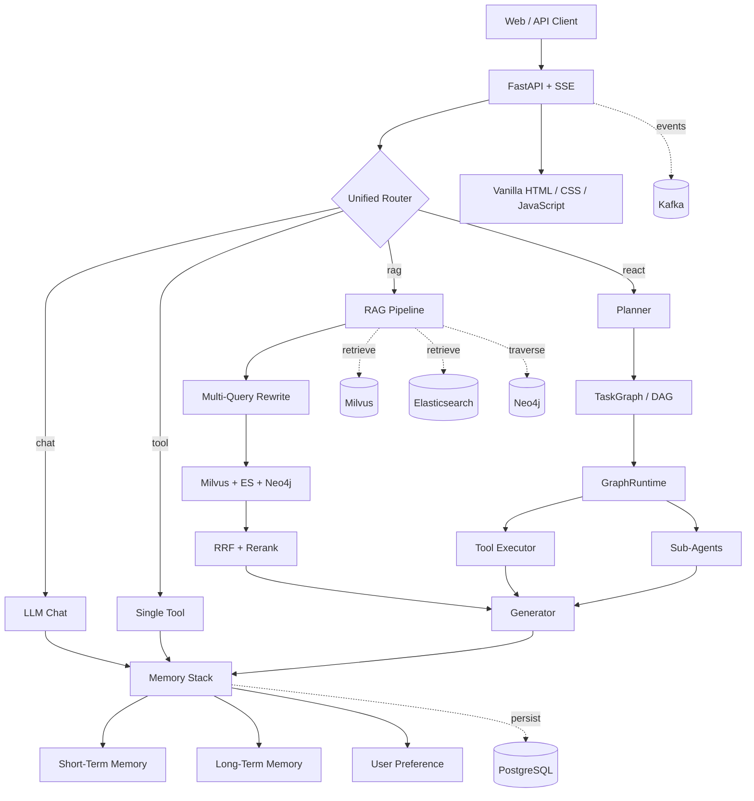

<div align="center">

# 🤖 AGI-Mira

**一个面向真实工程场景的可扩展 AI Agent Runtime**

集成智能路由、图式任务编排、混合 RAG、分层记忆、文档工作流、工具调用与流式交互。

<p>
  <a href="https://www.python.org/"></a>
  <a href="https://fastapi.tiangolo.com/"></a>
  <a href="https://www.docker.com/"></a>
  <a href="https://www.postgresql.org/"></a>
  <a href="https://milvus.io/"></a>
</p>
<p>
  <a href="https://www.elastic.co/elasticsearch"></a>
  <a href="https://neo4j.com/"></a>
  <a href="https://kafka.apache.org/"></a>
  
  
</p>

[核心特性](#-核心特性) · [系统架构](#-系统架构) · [快速开始](#-快速开始) · [API](#-api-概览) · [项目结构](#-项目结构)

</div>

---

## ✨ 项目简介

AGI-Mira 是一个以 FastAPI 为入口的综合型 AI Agent 项目。一次请求可以根据显式配置或规则路由进入普通对话、单工具调用、知识库问答或图式多步执行，并在同一运行时中组合 LLM、RAG、Memory、Sub-Agent、Sandbox 与外部基础设施。

项目强调两件事：一是将 Planner、Executor、Generator、Retrieval 和 Memory 拆成可独立演进的模块；二是在部分外部服务不可用时仍允许核心应用启动，便于本地开发和逐步接入基础设施。

> [!NOTE]
> 当前实现具备完整的 Agent 工程骨架，但仍处于持续演进阶段。基础设施降级保证的是应用可启动，并不代表所有增强能力都能在纯内存模式下完整运行。

## 🚀 核心特性

| 能力 | 实现 |
| --- | --- |
| **统一请求路由** | 支持 `chat`、`tool`、`rag`、`react` 四种模式，显式选择优先于自动路由 |
| **图式 Agent 编排** | Planner 生成任务 DAG，GraphRuntime 提供拓扑分层、并发执行、竞速、重试与取消 |
| **混合 RAG** | Parent–Child 切分、Multi-Query 改写、Milvus / Elasticsearch / Neo4j 多路召回、RRF 融合与 LLM Rerank |
| **分层记忆** | 短期对话窗口、长期语义记忆、用户偏好与 Graph Memory，支持跨会话持久化 |
| **工具系统** | 内置时间、天气、搜索、RAG、文档工具，可运行时注册轻量 HTTP 风格工具 |
| **文档工作流** | 文档上传、解析、版本管理、RAG 入库，以及 Research / Writer / Review / Doc 子 Agent |
| **安全沙箱** | Docker / Local / Mock 后端，提供命令校验、资源限制、只读根文件系统和默认禁网能力 |
| **流式与可观测性** | SSE 输出路由、步骤、工具、检索和 token 事件；支持取消信号与任务快照 |
| **渐进式基础设施** | PostgreSQL、Milvus、Elasticsearch、Neo4j、Kafka 可按需接入，连接失败时进行能力级降级 |

## 🏗 系统架构



### 一次请求如何流转

```text
HTTP Request
  → prepare（输入、记忆写入、路由决策）
  → dispatch（Chat / Tool / RAG / Graph Runtime）
  → finalize（答案、记忆、快照、事件）
  → JSON 或 SSE Response
```

多步任务采用 **Planner → TaskGraph → GraphRuntime → Generator** 的图式编排；它不是无限自反循环式的经典 ReAct，而是更容易观察、测试和控制的 DAG 执行模型。

## 🧰 技术栈

| 层次 | 技术 | 职责 |
| --- | --- | --- |
| Web / API | FastAPI、Pydantic、Uvicorn、SSE | HTTP 接口、参数校验、静态前端、流式事件 |
| LLM | OpenAI 兼容 Chat Completions、火山方舟 Embedding | 对话、规划、生成、改写、重排、偏好抽取 |
| Agent Runtime | UnifiedAgent、TaskGraph、GraphRuntime | 路由、DAG 调度、并发、竞速、重试、取消 |
| Retrieval | Milvus、Elasticsearch、Neo4j | 向量检索、全文检索、图谱扩展 |
| Storage / Event | PostgreSQL、Kafka | 记忆、文档、快照持久化与事件发布 |
| Tool / Sandbox | 动态工具、Docker Sandbox | 工具执行、命令校验与隔离 |
| Frontend | HTML、CSS、JavaScript | 对话、工具选择、文档上传和执行过程展示 |

## ⚡ 快速开始

### 环境要求

- Python 3.11（推荐）
- pip 23+
- Docker 与 Docker Compose（可选，用于完整基础设施和 Docker 沙箱）

### 方式一：本地启动

在项目根目录执行：

```bash
python -m venv .venv
```

激活虚拟环境：

```bash
# Windows PowerShell
.\.venv\Scripts\Activate.ps1

# macOS / Linux
source .venv/bin/activate
```

安装依赖并创建本地配置：

```bash
python -m pip install -r requirements.txt

# Windows PowerShell
Copy-Item config/config.yaml config/config.local.yaml

# macOS / Linux
cp config/config.yaml config/config.local.yaml
```

编辑 `config/config.local.yaml`，至少为真实对话配置 LLM：

```yaml
llm:
  api_url: https://ark.cn-beijing.volces.com/api/v3/chat/completions
  api_key: your-api-key
  model: your-model

embedding:
  api_url: https://ark.cn-beijing.volces.com/api/v3/embeddings/multimodal
  api_key: your-api-key
  model: your-embedding-model
```

`config.local.yaml` 已被 `.gitignore` 忽略。没有 LLM Key 时应用仍可启动，但模型相关能力会使用降级结果。

启动服务：

```bash
python main.py
```

启动后访问：

- Web UI：<http://localhost:8090/>
- 健康检查：<http://localhost:8090/health>
- Swagger UI：<http://localhost:8090/docs>
- ReDoc：<http://localhost:8090/redoc>

### 方式二：Docker Compose

启动应用及完整基础设施：

```bash
docker compose up -d --build
docker compose ps
docker compose logs -f app
```

当前 Compose 会将 `config/config.yaml` 只读挂载到应用容器。部署前请通过安全的配置管理方式提供 LLM / Embedding Key，不要把真实密钥提交到仓库。

如果希望应用运行在本机、只用 Docker 启动外部服务：

```bash
docker compose up -d postgres elasticsearch etcd minio milvus kafka neo4j
python main.py
```

> Milvus 单机模式依赖 etcd 与 MinIO，首次启动和健康检查通常需要更长时间。

## ⚙️ 配置说明

默认配置位于 [`config/config.yaml`](./config/config.yaml)。加载优先级如下：

```text
显式传入路径 → AGI_CONFIG → config/config.local.yaml → config/config.yaml
```

| 配置段 | 用途 | 是否必需 |
| --- | --- | --- |
| `llm` | 对话、规划、生成、改写、重排 | 真实模型调用时必需 |
| `embedding` | RAG 与长期记忆向量化 | 真实语义检索时必需 |
| `postgres` | 长期记忆、偏好、文档、快照 | 增强能力必需 |
| `milvus` / `elasticsearch` / `neo4j` | 混合检索与知识图谱 | 完整 RAG 必需 |
| `kafka` | Agent / RAG / Memory 事件 | 可选 |
| `search` | Tavily 联网搜索 | 可选 |
| `rag` / `memory` / `graph_runtime` | 检索、记忆与图执行策略 | 可调 |
| `sandbox` / `security` | 命令执行后端与安全策略 | 使用命令工具时必需 |

可用的路径类环境变量：

| 变量 | 说明 |
| --- | --- |
| `AGI_CONFIG` | 指定配置文件路径 |
| `AGI_PROJECT_ROOT` | 覆盖项目根目录 |
| `FRONTEND_DIR` | 指定静态前端目录 |

## 🔌 API 概览

| 方法 | 路径 | 说明 |
| --- | --- | --- |
| `GET` | `/health` | 基础设施健康状态 |
| `POST` | `/api/chat` | 同步对话入口 |
| `POST` | `/api/chat/stream` | SSE 流式对话 |
| `POST` | `/api/chat/cancel` | 发送取消信号 |
| `POST` | `/api/upload` | 上传文本或 PDF 并写入文档库 / RAG |
| `GET / POST` | `/api/documents` | 列出或创建版本化文档 |
| `GET` | `/api/documents/{document_id}` | 获取指定文档 |
| `POST` | `/api/documents/{document_id}/ingest` | 将文档版本写入 RAG |
| `GET` | `/api/tools` | 获取当前工具列表 |
| `POST` | `/api/tools/mcp` | 注册轻量动态工具 |
| `GET` | `/api/memory` | 查看记忆摘要 |
| `GET` | `/api/snapshots` | 查看任务快照 |
| `GET` | `/api/status` | 查看 Agent 运行状态 |

同步对话示例：

```bash
curl -X POST http://localhost:8090/api/chat \
  -H "Content-Type: application/json" \
  -d '{"message":"请总结这个项目的核心能力","use_rag":false}'
```

SSE 流式对话示例：

```bash
curl -N -X POST http://localhost:8090/api/chat/stream \
  -H "Content-Type: application/json" \
  -d '{"message":"查询北京天气并给出出行建议","selected_tools":["get_weather"],"explicit":true}'
```

## 🗂 项目结构

```text
AGI-Mira/
├── main.py                  # 应用入口与依赖装配
├── config/                  # YAML 配置与加载逻辑
├── frontend/                # 单页 Web UI
├── internal/
│   ├── agent/               # 路由、Planner、GraphRuntime、Sub-Agent
│   ├── document/            # 文档解析、版本与文档库
│   ├── graph/               # TaskGraph 与知识图谱
│   ├── handler/             # FastAPI 路由与 SSE
│   ├── infra/               # 基础设施装配与降级
│   ├── llm/                 # LLM / Embedding 客户端
│   ├── memory/              # 短期、长期、偏好与图记忆
│   ├── platform/            # PG / ES / Milvus / Neo4j / Kafka 客户端
│   ├── promptctx/           # 多源 Prompt Context 装配
│   ├── rag/                 # 切分、改写、混合召回、融合与重排
│   ├── repo/                # 数据访问层
│   ├── sandbox/             # Docker / Local / Mock 沙箱
│   └── tools/               # 内置工具与工具执行器
├── tests/                   # Agent、RAG、Memory、API 等测试
├── Dockerfile
├── docker-compose.yml
└── requirements.txt
```

## 🧪 测试

`pytest` 仅用于开发测试，不在运行时依赖中：

```bash
python -m pip install pytest
python -m pytest -q
```

测试覆盖请求路由、SSE、图调度、并发工具、取消、RAG、Memory、文档库、配置一致性和故障恢复状态等关键路径。

## 🧭 能力边界

- Prompt Context Assembler 已实现并有测试覆盖，但生产请求主链仍在逐步迁移。
- 当前多步执行更准确地属于图式 Planner–Executor–Generator，而不是无限循环式 ReAct。
- 快照用于状态留存与观测；完整 DAG 中断点续跑仍在完善。
- 动态工具注册目前是轻量 HTTP 风格接口，并非完整 MCP 协议实现。
- 无 PostgreSQL / Milvus / Elasticsearch / Neo4j 时应用可以启动，但完整混合 RAG 不可用。
- 当前默认用户状态仍需进一步完善多用户、多会话隔离。

## 🤝 参与贡献

欢迎通过 Issue 或 Pull Request 提交问题、功能建议与改进。提交代码前请确保：

1. 不提交 API Key、密码或其他敏感配置；
2. 新增行为附带对应测试；
3. `python -m pytest -q` 可以通过；
4. 提交信息建议遵循 [Conventional Commits](https://www.conventionalcommits.org/)。

---

<div align="center">
  <sub>道阻且长，行则将至。</sub>
</div>
